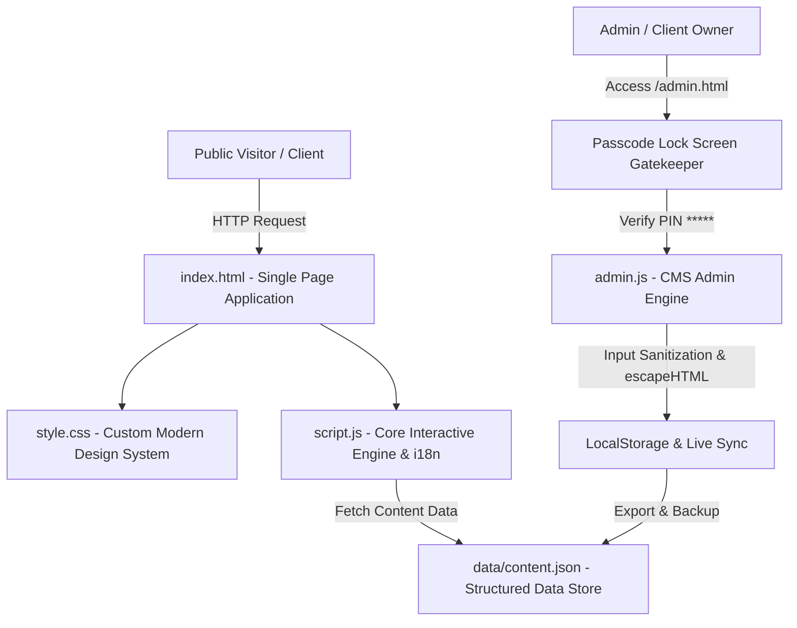

# 🎓 Academic Portfolio & Live CMS Platform — Dr. Khofidotur Rofiah, M.Pd., Ph.D.


Selamat datang di repositori resmi website portofolio akademik berstandar internasional dan sistem pengelola konten **Admin CMS Live Mode** untuk **Dr. Khofidotur Rofiah, M.Pd., Ph.D.** (Kepala Program Studi & Dosen Pendidikan Luar Biasa, Universitas Negeri Surabaya).

Website ini dibangun menggunakan arsitektur **Modern Vanilla Static Architecture** dengan performa maksimal, keamanan berlapis dari serangan siber, sistem penerjemahan bilingual *real-time*, serta pengelola konten visual tanpa perlu ngoding (*Zero-Code CMS*).

---

## 🔗 🌐 Live Demo & Portify Platform

- 📌 **Live Website Portfolio:** [http://localhost:5500/](http://localhost:5500/)
- ⚙️ **Admin CMS Portal:** [http://localhost:5500/admin.html](http://localhost:5500/admin.html)
- 🚀 **Built with Portify Platform:** [https://portify-sepia.vercel.app/](https://portify-sepia.vercel.app/)

---

## 🏛️ 1. Arsitektur Teknikal & Sistem Kode (Technical Architecture)



### 🛠️ **Teknologi Utama (Tech Stack):**
- **Core Frontend:** HTML5 Semantik, Vanilla CSS3 (Custom Tokens, Flexbox, CSS Grid, Glassmorphism), Modern JavaScript (ES6+ Asynchronous DOM Operations).
- **Data Persistence:** `data/content.json` (Structured JSON Schema) + `localStorage` (Instant Live Sync) + `sessionStorage` (Secure Auth Token).
- **Keamanan (Security Engine):**
  - **Passcode Gatekeeper:** Modal Layar Kunci Otentikasi PIN 6 Digit sebelum memasuki Dasbor Admin CMS.
  - **Stored XSS Protection:** Pembersihan input string dengan `escapeHTML()` sebelum di-render ke DOM.
  - **URL Sanitizer (`sanitizeURL`):** Validasi skema URL (`http://`, `https://`) murni untuk mencegah *JavaScript Injection Payload*.
  - **Vercel Security Headers:** `X-Content-Type-Options`, `X-Frame-Options`, `Referrer-Policy`, `X-XSS-Protection`.
- **Dynamic UX Features:**
  - **Scroll-Triggered Count-Up Counter:** Animasi angka statistik hero yang berjalan otomatis saat di-scroll ke area pandang (*Viewport Intersection Observer*).
  - **Bilingual i18n Engine:** Mode Bahasa Indonesia (ID) & English (EN) yang tersimpan otomatis di browser pengunjung.
  - **Filterable Publications & Live Search:** Filter kategori Scopus, Inklusif, Signalong, serta pencarian judul paper instan.
  - **Equal-Height Card Layout:** Simetri kartu publikasi dan galeri dengan komposisi seimbang di layar desktop dan seluler.

---

## 🔒 2. Fitur Keamanan Admin CMS (Security Hardening)

Admin CMS dilengkapi sistem perlindungan berlapis untuk memastikan data portofolio aman dari peretasan:

| Fitur Keamanan | Deskripsi | Status |
| :--- | :--- | :---: |
| 🔑 **PIN Lock Screen** | Otentikasi PIN 6 Digit (Default: `123456`) sebelum bisa mengakses CMS | 🟢 Aktif |
| 🔐 **Ubah PIN Mandiri** | Klien/Admin dapat mengubah PIN kapan saja di menu `🔒 Keamanan PIN` | 🟢 Aktif |
| 🛡️ **Anti-XSS Sanitizer** | Encoder otomatis `escapeHTML()` mencegah injeksi skrip berbahaya | 🟢 Aktif |
| 🔗 **Safe Link Filter** | Memblokir link berbahaya dengan skema `javascript:` atau `vbscript:` | 🟢 Aktif |
| 🚪 **Session Auto-Lock** | Sesi akses otomatis terkunci kembali ketika tab browser ditutup | 🟢 Aktif |

---

## 📖 3. Panduan Penggunaan Admin CMS (User Guide)

### 1. Masuk ke Dasbor Admin
1. Buka **`admin.html`** di browser.
2. Masukkan **PIN Akses Admin**: `123456`.
3. Klik **`Masuk ke Dasbor Admin 🔓`**.

### 2. Mengelola Konten
- 👤 **Profil & Bio:** Ubah foto profil, nama, jabatan, email, dan 4 angka statistik hero.
- 📚 **Publikasi:** Tambah/Edit/Hapus karya paper ilmiah, jurnal, tahun, dan link ResearchGate/Scopus.
- 🔬 **Fokus Riset:** Perbarui 4 kartu fokus penelitian dan gambar sampulnya.
- 📰 **Blog Artikel:** Kelola artikel publikasi populer dan isinya.
- 🖼️ **Galeri:** Unggah dokumentasi foto kegiatan pengabdian masyarakat & workshop.
- 🎥 **Video Showcase:** Atur URL embed YouTube dan foto cover video.
- 🔐 **Keamanan PIN:** Ubah PIN Sandi akses admin secara mandiri.

### 3. Menyimpan Permanen (Export & Deploy)
1. Perubahan data tersimpan **otomatis secara instan** di browser lokal.
2. Klik tombol **`Download content.json Terbaru`** di tab *Simpan & Export*.
3. Simpan file `content.json` tersebut ke folder `data/` dalam proyek repositori GitHub Anda.
4. Lakukan `git push` &ndash; website publik akan ter-update permanen di Vercel / GitHub Pages!

---

## 💼 4. Referensi Layanan Pemesanan Klien (Portify Ordering Guide)

> **Apakah Anda tertarik memiliki website portofolio profesional atau platform CMS visual seperti ini?**  
> Repositori ini dapat menjadi **contoh referensi (*Showcase Reference*)** untuk klien yang ingin memesan pembuatan website portofolio akademik, eksekutif, maupun profil instansi.

### 🌟 **Pilihan Paket Pemesanan Portify:**

```
+-----------------------------------------------------------------------------------+
|                            PAKET PORTOFOLIO PORTIFY                               |
+--------------------------+--------------------------+-----------------------------+
| 🎓 PAKET ACADEMIC PRO    | 💼 PAKET EXECUTIVE PRO   | 🏛️ PAKET INSTITUTION/PRODI  |
+--------------------------+--------------------------+-----------------------------+
| • Hero Profil + Stats    | • Personal Branding Hero | • Website Prodi / Jurusan   |
| • List Publikasi Scopus  | • Portfolio Highlight    | • CMS Multi-Admin Portal    |
| • Research Focus Cards   | • Interactive Gallery    | • Integrasi Sistem Kampus   |
| • Admin CMS Visual       | • Blog & Media Reader    | • Custom Domain (.ac.id)    |
| • Bilingual (ID | EN)   | • Admin CMS Live Sync    | • Support Maintenance 1 Thn |
+--------------------------+--------------------------+-----------------------------+
```

### 📩 **Cara Memesan:**
Kunjungi platform pembuatan portofolio resmi **Portify**:  
👉 **[https://portify-sepia.vercel.app/](https://portify-sepia.vercel.app/)**  
*(Atau hubungi tim pengembangan via link kontak yang tertera di platform)*.

---

## 📁 5. Struktur Berkas Repositori

```
khofidotur-rofiah/
├── index.html            # Halaman Utama Website Portofolio (Bilingual SPA + SEO)
├── admin.html            # Dasbor Visual CMS Admin Portal (Passcode Protected)
├── admincms.html         # Mirror Endpoint CMS Admin Portal
├── admin.js              # Mesin Admin CMS (CRUD Data, PIN Auth, XSS Sanitizer, Export JSON)
├── script.js             # Mesin Website Publik (Count-Up Counter, Filter, Search, i18n)
├── style.css             # Design System (Vanilla CSS, Glassmorphism, Responsive Grid)
├── vercel.json           # Konfigurasi Header Keamanan & Cache Deployment Vercel
├── data/
│   └── content.json      # Single Source of Truth Basis Data Konten
└── assets/
    ├── foto-profil-nobg.png # Foto Hero Cutout Transparan
    └── foto-profil.jpg      # Foto Profil Cadangan
```

---

©Platform Powered by [Portify](https://portify-sepia.vercel.app/)
